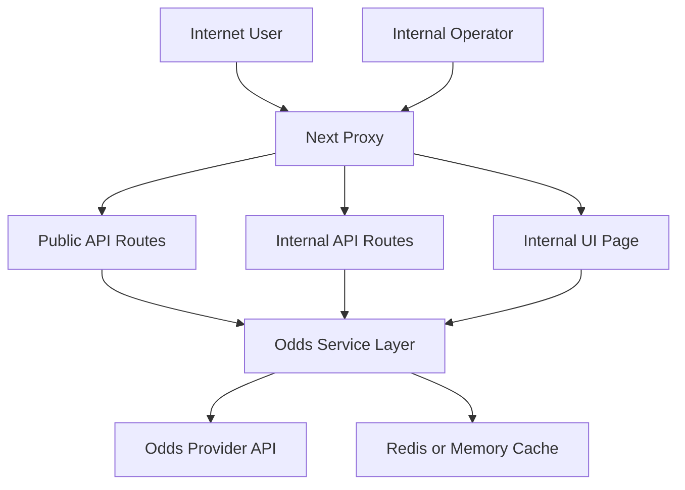

## Assumption validation check-in (no response yet)
- The production deployment is internet-exposed on Vercel, with all `/api/*` routes publicly reachable unless explicitly protected.
- EmpirePicks is a betting analytics app and does not intentionally store regulated PII; primary sensitive assets are API credentials, model integrity, and service availability.
- Internal/operator surfaces are intended for restricted staff access only (`/api/internal/*`, `/internal/*`).
- Upstash Redis is optional; if absent, the app must still remain resilient under abuse.
- The Odds API is the only intended upstream host; custom host override should be treated as an operator-only control.

Targeted context questions that would change ranking:
1. Will internal routes be accessible over the public internet, or behind network-level allowlists/VPN?
2. Are there contractual availability SLOs for public APIs (for example line refresh latency targets)?
3. Is multi-tenant/customer-segregated data planned before launch?

Proceeding with the assumptions above.

## Executive summary
EmpireRevo’s highest security risks were pre-auth access to internal surfaces, error/detail leakage from upstream failures, and abuse-driven availability risk on expensive odds endpoints. The launch hardening focused on strict internal auth, shared input validation, sanitized error contracts, trusted upstream host enforcement, stronger route-aware rate limiting with fallback, and baseline browser hardening headers.

## Scope and assumptions
- In scope: `app/api/**/*`, `app/internal/**/*`, `proxy.ts`, `lib/server/odds/**/*`, `next.config.mjs`, dependency/runtime config.
- Out of scope: CI/CD hardening, Vercel project IAM, external WAF/network policy controls, developer workstation security.
- Runtime vs dev separation:
  - Runtime threats prioritize API routes, server-side odds ingestion, proxy/rate limiting, and internal operator endpoints.
  - Dev/tooling findings (lint/test dependency chain) are included separately as lower operational priority unless they affect runtime packages.
- Open questions that materially affect ranking:
  - Whether `/internal/*` is also restricted at network edge (VPN/IP allowlist).
  - Required uptime/error budget during upstream odds outages.
  - Future tenant model (single-tenant operator tool vs multi-tenant customer data plane).

## System model
### Primary components
- Next.js app/router server and API routes (`app/api/*`, `app/*page.tsx`).
- Proxy enforcement layer (`proxy.ts`) for rate limiting and internal-route gatekeeping.
- Odds ingestion/client pipeline (`lib/server/odds/client.ts`, `lib/server/odds/oddsService.ts`, `lib/server/odds/aggregator.ts`).
- Caching/persistence layer (Upstash Redis + memory fallback in `lib/server/odds/cache.ts`, `lib/server/odds/persistence.ts`).
- Internal analytics/diagnostics surfaces (`app/api/internal/*`, `app/internal/engine/page.tsx`, `lib/server/odds/internalDiagnostics.ts`).

### Data flows and trust boundaries
- Internet user -> Next.js API routes (`/api/*`)  
  - Data: query params, public board/fair/odds requests  
  - Channel: HTTPS  
  - Security: proxy rate limits (`proxy.ts`), request validation (`lib/server/odds/requestValidation.ts`)  
  - Validation: enum/range/token checks on sport/market/model/regions/books/limits.
- API server -> The Odds API upstream  
  - Data: sport/market filters, provider API key  
  - Channel: HTTPS fetch (`lib/server/odds/client.ts`, `app/api/status/route.ts`)  
  - Security: trusted base URL allowlist (`getOddsApiBaseUrl` in `lib/server/odds/env.ts`), timeout + retry controls  
  - Validation: server-controlled URL construction, host/protocol constraints.
- Internet/internal operator -> internal routes (`/api/internal/*`, `/internal/*`)  
  - Data: diagnostics/timeline/evaluation payloads  
  - Channel: HTTPS  
  - Security: internal key enforcement in proxy + API auth (`proxy.ts`, `lib/server/odds/internalAuth.ts`)  
  - Validation: auth first, then bounded internal query validation.
- App server -> Redis/memory cache  
  - Data: normalized odds, fair board snapshots, diagnostics data  
  - Channel: Redis REST / in-process memory  
  - Security: optional Redis credentials via env vars, fallback behavior controls  
  - Validation: keyed cache wrappers and bounded retention settings.

#### Diagram

## Assets and security objectives
| Asset | Why it matters | Security objective (C/I/A) |
|---|---|---|
| `ODDS_API_KEY` | Credential to paid upstream odds feed | C |
| `EMPIRE_INTERNAL_API_KEY` | Gate to internal diagnostics/operator surfaces | C/I |
| Fair-line and EV computation outputs | Core product integrity and user trust | I |
| API availability (`/api/fair`, `/api/board`, `/api/odds`) | User-facing uptime and responsiveness | A |
| Internal diagnostics/evaluation payloads | Operational signals and model tuning context | C/I |
| Cache/persistence snapshots | Enables continuity and anti-thrash behavior | A/I |

## Attacker model
### Capabilities
- Remote unauthenticated internet access to public routes.
- High-rate request generation and parameter fuzzing against API endpoints.
- Ability to induce upstream errors and exploit reflective error payloads.
- Opportunistic probing for exposed internal diagnostics routes.

### Non-capabilities
- No assumed direct shell/host access.
- No assumed direct control of deployment environment variables.
- No assumed compromise of Redis credentials before exploiting app-level weaknesses.

## Entry points and attack surfaces
| Surface | How reached | Trust boundary | Notes | Evidence (repo path / symbol) |
|---|---|---|---|---|
| `/api/fair` | Public HTTP GET | Internet -> API | Expensive upstream + fair-engine aggregation path | `app/api/fair/route.ts`, `lib/server/odds/oddsService.ts#getFairBoard` |
| `/api/board` | Public HTTP GET | Internet -> API | Fan-out board derivation and feed construction | `app/api/board/route.ts` |
| `/api/odds` and `format=raw` | Public/internal HTTP GET | Internet -> API | Raw payload mode requires stronger control | `app/api/odds/route.ts` |
| `/api/status` | Public HTTP GET | Internet -> API -> upstream | Upstream reachability probe | `app/api/status/route.ts#checkOddsApi` |
| `/api/internal/*` | HTTP GET | Internet -> internal API | Operator diagnostics/evaluation/timeline | `app/api/internal/*`, `lib/server/odds/internalAuth.ts` |
| `/internal/engine` | Browser route | Internet -> internal UI | Operator analytics page | `app/internal/engine/page.tsx`, `proxy.ts` |
| Upstream fetch client | Server-side fetch | API -> upstream | SSRF/misroute risk if base host is unsafe | `lib/server/odds/client.ts#fetchOddsFromUpstream` |
| Proxy limiter/auth gate | Pre-route middleware | Internet -> proxy | DoS and internal route gating choke point | `proxy.ts#proxy` |

## Top abuse paths
1. Attacker floods `/api/fair` with high-cardinality query permutations -> upstream fan-out and compute pressure -> availability degradation.
2. Attacker requests raw odds payload repeatedly -> large response amplification and internal data exposure -> increased bandwidth/compute costs.
3. Attacker probes `/api/internal/*` without auth -> obtains diagnostics/evaluation details -> model leakage and operator visibility loss.
4. Attacker triggers upstream failure modes -> app reflects raw upstream details -> internal implementation and error-context disclosure.
5. Attacker submits malformed values (`books`, `regions`, huge ints) -> parsing edge cases and expensive processing -> stability degradation.
6. Misconfigured `ODDS_API_BASE` points to untrusted host -> server fetches attacker-controlled endpoint -> integrity and confidentiality risk.
7. Upstash outage removes centralized rate limiting -> burst abuse proceeds unless fallback controls exist -> DoS window.

## Threat model table
| Threat ID | Threat source | Prerequisites | Threat action | Impact | Impacted assets | Existing controls (evidence) | Gaps | Recommended mitigations | Detection ideas | Likelihood | Impact severity | Priority |
|---|---|---|---|---|---|---|---|---|---|---|---|---|
| TM-001 | Internet attacker | Public access to internal paths | Calls `/api/internal/*` and `/internal/*` without credentials | Internal telemetry leakage and operator surface exposure | Internal diagnostics payloads, model integrity context | Internal auth helper + proxy gate (`lib/server/odds/internalAuth.ts`, `proxy.ts`), HttpOnly session endpoint (`app/api/internal/session/route.ts`) | Key distribution still manual; session cookie currently carries shared internal secret value | Move to signed short-lived session tokens or SSO-backed session identity | Alert on repeated 401/503 for internal routes; track auth failures by IP | Medium | High | High |
| TM-002 | Internet attacker | Public API reachability | Sends high-rate requests to expensive endpoints | Availability degradation and upstream quota burn | API availability, upstream API quota | Route-specific limits + fallback (`proxy.ts`) and caching (`lib/server/odds/cache.ts`), production fail-closed requirement for distributed backend | In-memory fallback remains per-instance when explicitly allowed | Keep Upstash enabled in prod; add edge-level WAF/IP reputation controls | Monitor 429 rate and upstream call volume anomalies | Medium | High | High |
| TM-003 | Internet attacker | Raw response mode reachable | Requests `format=raw` to maximize payloads | Data exposure amplification and response-size abuse | Availability, response surface minimization | Internal auth + raw cap (`app/api/odds/route.ts`) | Raw still intentionally available to authenticated operators | Keep raw as internal-only; consider field-level redaction and stricter default limits | Log raw endpoint usage and payload truncation counts | Medium | Medium | Medium |
| TM-004 | Internet attacker | Can force upstream failures | Triggers upstream 4xx/5xx and inspects responses | Information disclosure of internals/upstream details | Secret hygiene, internal topology confidentiality | Sanitized mapping (`lib/server/odds/apiErrors.ts`) | Public routes still expose coarse error codes (expected) | Keep error schema stable and generic; avoid propagating stack/cause text | Alert on spikes in `UPSTREAM_*` codes | Medium | Medium | Medium |
| TM-005 | Malicious client | API query control | Supplies malformed/oversized query values | Parser stress, undefined behavior, cache pollution | Availability, integrity of computed outputs | Shared validation layer (`lib/server/odds/requestValidation.ts`) | Validation coverage should be maintained as routes evolve | Require validator usage for new routes in PR review checklist | Track `BAD_REQUEST` volume and parameter-specific rejection metrics | High | Medium | Medium |
| TM-006 | Misconfiguration / insider error | Ability to set env vars | Sets unsafe upstream base URL | Potential SSRF/misrouting of server-side fetches | Credential handling, data integrity | HTTPS + allowlist enforcement (`lib/server/odds/env.ts#getOddsApiBaseUrl`) | Allowlist expansion still operator-controlled and must be reviewed | Restrict env var changes via deployment approvals; audit config diffs | Config change audit alerts for `ODDS_API_BASE`/`ODDS_API_ALLOWED_HOSTS` | Low | High | Medium |
| TM-007 | Browser-based attacker | Victim browser loads app | Attempts clickjacking/content-type confusion vectors | Session/UI manipulation risk | UI integrity and trust | CSP + frame/content headers (`next.config.mjs`) | CSP still permissive for Next runtime compatibility | Tighten CSP further once runtime script/style requirements are profiled | CSP/report-only telemetry before stricter enforcement | Low | Medium | Low |

## Criticality calibration
- Critical:
  - Pre-auth compromise enabling code execution or cross-tenant data exfiltration.
  - Systemic auth bypass exposing privileged operator data/actions.
- High:
  - Public-route abuse that reliably causes service outage or upstream quota exhaustion.
  - Internal route exposure without required auth under realistic deployment.
  - Credential misuse paths that compromise upstream account integrity.
- Medium:
  - Reflective error/detail leaks without direct secret disclosure.
  - Route-specific abuse that is partially mitigated by caching/rate limits but still impactful.
  - Misconfiguration-dependent fetch target risks constrained by allowlists.
- Low:
  - Browser hardening gaps with limited exploitability in current architecture.
  - Issues requiring unlikely preconditions and yielding low-sensitivity exposure.

## Focus paths for security review
| Path | Why it matters | Related Threat IDs |
|---|---|---|
| `proxy.ts` | First-line abuse controls and internal-route gate logic | TM-001, TM-002 |
| `app/api/odds/route.ts` | Raw mode handling and public odds response surface | TM-003, TM-004 |
| `app/api/fair/route.ts` | Expensive aggregation entry point and validation boundary | TM-002, TM-005 |
| `app/api/board/route.ts` | Public board generation and upstream fan-out path | TM-002, TM-005 |
| `app/api/internal/diagnostics/route.ts` | Internal diagnostics exposure and auth enforcement | TM-001 |
| `app/api/internal/evaluation/route.ts` | Internal performance analytics exposure and auth enforcement | TM-001 |
| `app/api/internal/timeline/route.ts` | Internal timeline + market pressure endpoint protections | TM-001, TM-005 |
| `lib/server/odds/internalAuth.ts` | Central internal auth policy and credential comparison | TM-001 |
| `lib/server/odds/requestValidation.ts` | Shared schema enforcement for query inputs | TM-005 |
| `lib/server/odds/client.ts` | Upstream fetch target construction, timeout/retry safety | TM-004, TM-006 |
| `lib/server/odds/env.ts` | Trusted upstream host allowlisting and env parsing | TM-006 |
| `next.config.mjs` | Global browser security headers/CSP policy | TM-007 |

## Quality check
- Entry points covered: yes (`/api/*`, `/api/internal/*`, `/internal/*`, upstream fetch client, proxy).
- Trust boundaries represented in threats: yes (internet->API, API->upstream, operator->internal, API->cache).
- Runtime vs CI/dev separation: yes (runtime prioritized; dev-only dependency note separated).
- User clarifications reflected: no additional responses received; assumptions explicitly stated.
- Assumptions and open questions explicit: yes.
